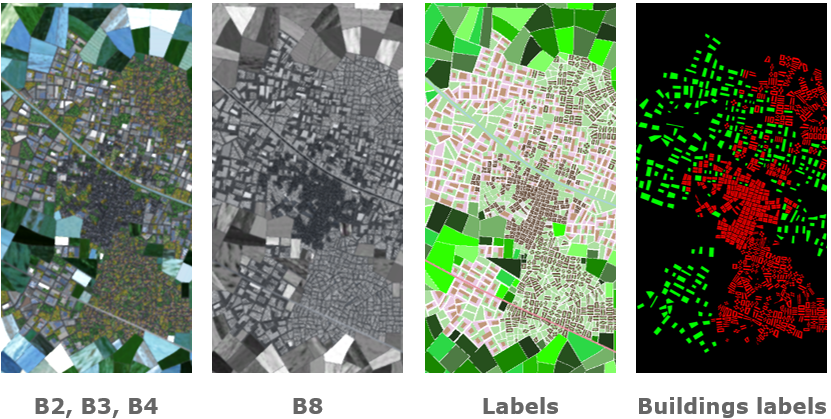
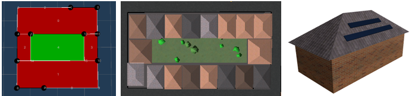
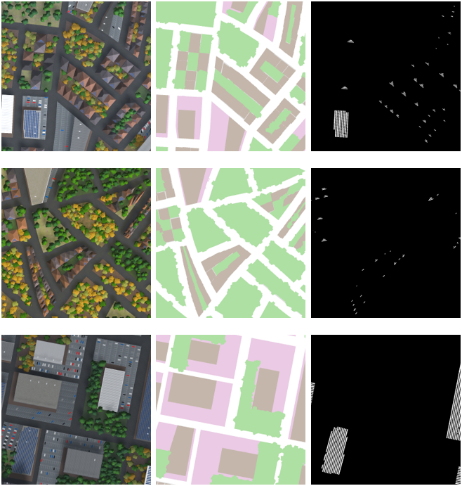
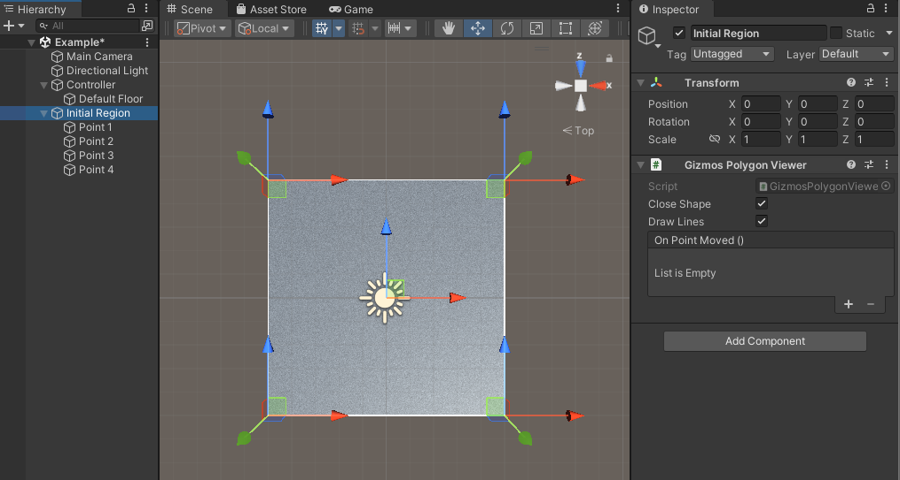

# SD4EO-PBR
Physically-Based Synthetic Data Simulator to generate datasets for 3 different use cases:

Use case 1: Crop field classification, [example of Dataset](https://zenodo.org/records/12605696)

Use case 2: Human settlement classification, [example of Dataset](https://zenodo.org/records/14016650)

Use case 3: Solar panel identification, [example of Dataset](https://zenodo.org/records/12579172)

## Funding
This research work has been funded by the European Space Agency (ESA) under the FutureEO program and the SD4EO project (Contract No.: 4000142334/23/I-DT), supervised by the ESA Φ-lab.

## PROJECT SUMMARY

### INTRODUCTION AND PURPOSE

The Physically-Based Synthetic Data Simulator is a development within the SD4EO (Synthetic Data for Earth Observation) project. It consists of a synthetic image generator that simulates images similar to those obtained by SENTINEL and SENTINEL-2 satellites, as well as low-altitude images resembling those captured by drones or aerial vehicles.
The primary objective of this development is to generate synthetic images for training AI-based classification systems. These systems require large volumes of images for both training and validation, with the specific requirement that each image has associated labels for every type of element it contains. For example, in the case of crop types, labels must identify the type of crop to which each pixel in the image corresponds. When using real images, this labelling process is often done semi-automatically or manually, which can lead to errors or mislabelling.
Synthetic images, however, allow for the creation of perfectly aligned pixel-level label layers without errors or human effort. Consequently, having a synthetic image generator with these capabilities enables the generation of large datasets for training AI systems without manual labelling and without the errors associated with traditional labelling processes.
Moreover, synthetic data provides a controlled environment where variations in parameters, can be simulated with precision, allowing for the creation of diverse and challenging datasets. This helps AI models generalize better and improve accuracy when faced with real-world variations. Additionally, synthetic datasets can be customized to address specific use cases, in this case, the generator has been designed to cover the three proposed use cases in the SD4EO project: crop identification, human settlement classification, and solar panel monitoring.
To generate synthetic images, the system is composed of three modules. The procedural generation module creates spatial partitions according to user specifications and can generate various random distributions of 3D elements while meeting these specifications. Once the element distributions are generated, the multispectral rendering module can produce different types of images based on these distributions. Specifically, this module can render images corresponding to bands 2, 3, 4, 8, and 11 of the SENTINEL-2 satellites and SAR images generated by the SENTINEL satellites for the crop classification use case. Additionally, the module can render images corresponding to bands 2, 3, 4, and 8 of SENTINEL-2 for urban areas associated with the use cases of human settlement classification and solar panel monitoring. Finally, the user interface module allows for the selection of parameters to define element distributions and render datasets, even without knowledge of computer graphics.

### USER INTERFACE MODULE

The system user interface is designed to give the user full flexibility over the synthetic data to be generated. To this end, the interface has been divided into different sections that allow the selection of values for each variable. The available sections are:
•	Area contour, for the definition of the outline of the region to simulate. This area contour can be also distributed randomly with a desired radius and deformation value.
•	Polylines, for the definition of important linear elements like roads, railroads or rivers, that must be considered when creating the different 3D elements.
•	Zones, for the definition of different types of elements like residential or non-residential buildings, industrial zones or each kind of crop field present in the dataset.
•	Templates, for the definition of different distributions of building blocks.
•	3D objects, for the definition of each element and their textures.
•	Crop fields, for the definition of the textures that will be used to render each kind of crop field in each month.
•	Dataset generation, for the configuration of the random values to generate the dataset with different distributions that follow all the previous parameters.
All parameters and settings have been designed to be easily editable by the user. For example, zone editing allows the user to choose the shape and size of the zone, select its position in the 3D scene, and specify the type of element it represents.

### PROCEDURAL GENERATOR

The procedural generator is responsible for generating the distribution of various 3D elements in two steps: space subdivision into parcels and template assignment to each parcel, all based on parameters defined by the user or assigned randomly according to the same distribution.
For the initial space subdivision, a Voronoi division is used, with the distribution of Voronoi points determining the size and regular appearance of the divisions. Once this first division is created, a streamline-based process further subdivides the space recursively until the user-defined plot sizes are reached.

Once the parcels are obtained, a type is assigned to each plot, and 3D elements are distributed according to predefined templates. These templates allow for the creation of different types of building blocks or industrial areas with various types of parking layouts, for example.

### MULTISPECTRAL RENDERER

The multispectral renderer enables rendering of 3D elements according to the previously created distributions. The renderer generates results using the PBR (Physically Based Rendering) model, commonly used in computer graphics, and textures that describe the surface reflectance for each band observed by the satellites. To simulate the temporal evolution of crop fields, sets of pre-obtained textures are used, corresponding to each month of the year and crop type. To generate the SAR signal, the mathematical distribution of the sampled signal is applied for each crop type and month of the year. As a final output, the renderer can generate the image corresponding to each band and the labels that describe the type of element represented by each pixel. For each distribution of crop fields 49 images are generated: 4 images for each month (B2B3B4, B8, B11 and SAR) and the corresponding label image.

### DATASET GENERATION AND RESULTS

As a result of the combination of the described modules, it is possible to generate large datasets that maintain user-specified distributions and pixel-level labelling of each element in the image. As an example, various distributions of crop fields and cities are shown, created based on user-defined zones and applying different random variations.

Finally, three examples from the low attitude point of view are generated, in this case 3 images are generated for each sample: RGB, label and solar panels mask images. The high detail in solar panels mask is very difficult to obtain with real images labelled with automatic or semi-automatic methods.

## USER MANUAL

In this section, we will create a new Unity scene and configure it to enable the generation of maps and datasets. The project contains two scenes that have already been configured: ‘City’ and ‘Crops Field.’ Each scene is configured according to its objective: either to represent a human settlement surrounded by crop fields (focusing on the city) or a crop field without any city representation. Let's look at the sequence of steps to follow to achieve the desired configuration.

### CREATION OF CONTROLLER AND MAIN GAME OBJECTS

When we create a new scene in Unity, it only has 2 game objects: a camera and a light. These game objects are useful, but we need to create some other game objects to be able to generate a map.

The main game object of the scene is the controller of the dataset generator. We must create a game object and add 2 custom script components: ‘Regions Controller’ and ‘Voronoi Controller’. There are a lot of variables that should be configured, but first, we need to create the rest of the game objects.

There are 3 main game objects that we must create: an empty object whose child game objects are the points that are the shape of the initial region (empty game objects with only the transform component), an empty object whose child game objects are the zones of the map (game objects with a custom script component called ‘Zone’), and an empty object whose child game objects are the polylines of the map (game objects with a custom script component called ‘Initial Streamline’). Let’s see their configuration. We should take in count that all the points will have coordinates (X, 0, Z), so we don’t work with the Y axis (XZ map).

#### INITIAL REGION

This part is easy to configure as we only need to create the 3D points following the right-hand rule, because the triangles of the meshes are created this way. We can add all the necessary points while we don’t break the mentioned rule.

See in the next figure what happens if we don’t follow the right-hand rule.

As we can see, the mesh is created but is not visible from the point of view of the camera, as the visible part of the mesh is on the other side of the mesh. The custom script component added to the ‘Initial Region’ game object is used to see the shape of the initial region with gizmos (very useful in editor mode). We need to do some configuration in the ‘Regions Controller’ script component to see the initial region mesh. The variables with a red line in the next figure must be filled.
‘Buildings Parent’ is the game object that is going to be the parent of all the meshes of the map (the position of this game object transform should be the origin point of the scene (0, 0, 0)), ‘Voronoi Controller’ is the other script of the controller game object, ‘Default Floor Material’ is the material of the generated floor (take in count that it will be the material of roads in cities and crops fields), and ‘Initial Region Parent’ is the transform of the game object whose child game objects define the shape of the initial region.

As we can see in the previous figure, there is a checkbox called ‘Random Initial Region’. If we don’t want to have the same initial shape, we can select this checkbox to create a different shape each time we generate a map. In this mode, we can change the number of points of the shape, the random seed of the simulation, and the minimum and maximum distances of the points to the center.

Select the mode that we prefer to create the initial region of our map.

#### INITIAL POLYLINES

The second step to configure the application consists in creating an empty game object whose child game objects are the initial polylines of the map. These child game objects will have a custom script component called ‘Initial Streamline’ with the following parameters: ‘parent’ is the transform of the polyline, ‘type’ is the type of the polyline (there are 3 possibilities: river, street and train), and ‘width’ is the width of the polyline (similar to ‘road width’ in zones). These polylines will define the shape of the map, so it’s important to define them before creating the map. The configuration of the polyline is like in the initial shape of the map: we need to define the points with empty game objects that are child of the parent (the order of the child game objects will define the shape of the polyline).

Also, if we select a river, it has 3 more variables to configure. This is made like this way because of 2 reasons: a river has different widths along its shape and a river usually has green zones surrounding it (there isn’t any building next to a river). The variable ‘river width percentage’ indicates the percentage of initial polyline that will be filled by water (in the center of the polyline) and the other 2 variables defines the random displacement of the river in each critical point of the polyline (these points are the ones defined in the inspector). For example, if the polyline is 50 % river, it should be 25 % green zone in each side of the river, but it has a random displacement since the 2 other variables. Although the polyline segments are straight, they will have curves to have more realistic results.

In the following image there’s an example of some polylines included in the controller of the application. It’s important to add the references of the script to the ‘initial polylines on inspector’ array of the controller. Also, as we can see in the image, marked with red lines, there are 4 variables that should be filled: ‘polylines parent’ is the game object whose child game objects are the initial polylines, and the other 3 variables are the materials of the meshes of the polylines.

Finally, there is an input field called ‘new polyline name’ where we can define the name of a new polyline that can be created by pressing the button ‘create new polyline’. This polyline will be created with 3 points and added automatically to the array of the controller. Also, we can randomize the polyline points following the ‘max point offset’ value, that defines the maximum displacement (in meters) that can have each point in a random point. The idea is to randomize the polylines without losing their previous shape.

#### ZONES

The third step to configure the application consists in creating an empty game object whose child game objects are the zones of the map. These child game objects will have 2 components: the transform that defines the center of the zone and a custom script component called ‘Zone’ with the following parameters: ‘parent’ is the transform mentioned previously, ‘type’ is the type of zone that will have the regions inside the zone (at the moment, there are 4 types: downtown, industrial, residential and crops field), ‘shape’ is the shape of the zone (circle, square or triangle), ‘shape side’ is the length of the zone (diameter in circle or side in square/triangle), ‘shape angle’ is the angle of the zone (useful for square and triangle), ‘road width’ is the width of the roads that separate the regions of the zone, ‘maximum plot side’ is the maximum length of the side of the regions (regions will be subdivided until this value is passed), ‘zone weight’ is the weight of the zone (if a region is in 2 or more zones at the same time, its region will depend on 2 values: zone weight and distance to the center of the zone), ‘voronoi random freedom’ is the factor that make the zone more Manhattan-alike or not (the value 0 will make totally straight roads and the value 1 will make random roads’ directions), ‘km scale’ is a value for passing from meters to kilometers (the value should be always 0,001 in our application), and ‘randomize’ is a checkbox made to randomize the variables of the zones of the map (if we want to remain a zone as we have configured it, we have to deselect this checkbox). In the next image, we can see an example of the script.

In the following image there’s an example of some zones included in the controller of the application. It’s important to add the references of the script to the ‘initial zones’ array of the controller. Also, as we can see in the image, marked with red lines, there are 3 variables that should be filled: ‘zones parent’ is the game object whose child game objects are the zones, and the other 2 variables are the materials of the floors of industrial and residential zones.

Finally, there is an input field called ‘new zone name’ where we can define the name of a new zone that can be created by pressing the button ‘create new zone’. This zone will be added automatically to the array of the controller.

### CONFIGURATION OF CONTROLLER VARIABLES

With the game objects that we have created in the previous point of the manual, we don’t need more of them (although we can create all the initial regions, zones or polylines that we want). Now, the following step in the configuration of the scene is to fill all the variables of the controller script. Let’s see the rest of the variables divided in tabs.

#### TEMPLATES

As we should know, the algorithm of the application is made of 2 main steps: streamline-based subdivision of the regions and template-based filling of the regions. For the second step, we need to develop the templates that are going to fill the regions.

In the previous figure we can see the prefabs in the controller of the scene, that are well configured. Let’s see how we can make a new template. Templates are saved in this folder. The folders have the individual templates, and the prefabs in the right have all the prefabs classified since the type of region.

Let’s see how to create a new template. First, we must add the custom script component ‘Template’ to an empty game object. In the script there is an array of points that define the shape of the template, is important to define the type of point (boundary vertex, convex corner, concave corner and inner vertex).

With these points we can define buildings, that have 3 parameters: the array of indices of the points that define the building (it’s very important to order them following the right-hand rule, as the regions), the initial index of the building and the type of building (this value will define the type of geometry that will be created).

#### SCRIPTABLE OBJECTS

For each template, we have custom ‘scriptable objects’ with the configuration for each template, as we can see in the following image.

For example, for buildings we have variables for materials and color of the meshes, widths and heights of the buildings and other configurations as the appearance of solar panels in buildings or trees in vegetation regions.

We can create new ‘scriptable objects’ following the steps made in the ones done.

#### RENDERING MATERIALS

The next tab is for the materials used to render the layers of the map. All the materials should be configured as “Unlit/Texture” for the result we want to obtain.

In the next image we can see an example of the configuration of a material for rendering.

#### RENDERING OPTIONS

The next (and final) step of the configuration is for rendering. We can select the number of random maps we want to generate in one execution (each map could take 2 minutes to finalize), the resolution and a meters/pixel factor for the images (the maximum resolution in meters are 10 km x 10 km). We can set only a main camera, or we can add some various zoom cameras for more detailed images. It’s important to set correctly the variable ‘render initial number’ to avoid the overwriting of the images (the variable actualize itself in each new map). Finally, as we can see in the following 2 images, there are 2 modes of rendering: one for crops fields and other for cities. In each one we can render different types of images, such as layers and mask images in cities, or different spectrums in crops fields.

  
  

### GENERATION OF DATASET

Finally, if we have done all the steps correctly, we will be able to generate datasets of images and geojsons by pressing the button ‘Generate multiple maps’. Make sure that the number of maps we want to generate and the first map id are correctly settled. The dataset will be generated in a specific folder in the persistent data of the project. The path is: “C:\Users\user\AppData\LocalLow\ARTEC - IRTIC – UV\SD4EO”, where ‘user’ is the name of the user we are using in our PC. In this folder we will find 4 different folders: ‘CropsFields’ (images and geojson of crops fields), “HumanSettlements” (images and geojson of cities), “SolarPanelsMask” (images of solar panels layer mask of cities), and “BuildingsMask” (images of buildings layer mask of cities).

With the generation of the dataset, we have finished the configuration of a scene and the generation of results.

# Author
[ARTEC research group](https://irtic.uv.es/artec)

IRTIC Institute

University of Valencia
